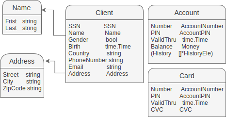
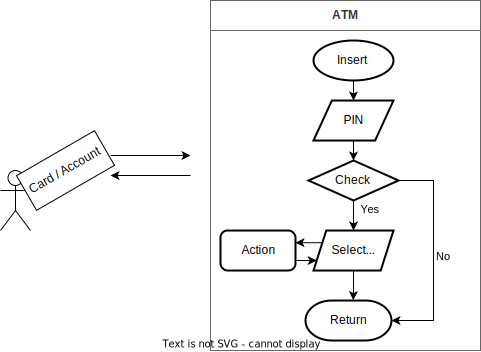

# Simple-ATM-controller

## __Assumption__
----
#### In project
- Thus account balance can be represented in integer.
- There are only 1 dollar bills in this world, no cents.
- You can simplify some complex real world problems if you think it's not worth illustrating in the project.

#### My
- In this project exist only one bank.
- One account can bind maximum 3 cards and one card can bind one account.
- Card means Debit card.
<br/><br/>

## __Schema__
----
- It is not real database.
- This is struct in code.
- Intentionally do not refer each other. (avoid memory leak; refer count)  
  

<br/><br/>

## __Flow__
----

<br/><br/>

## __Test__
----
For test, database is simply hashmap. Mock data generate by uuid and skip needless attribute.  


__Simple Unit test__
   ```script
   go test github.com/yusong-offx/myATM/bank
   go test github.com/yusong-offx/myATM/atm
   ```
   - It will check all unit.

__History test__
```go
func main() {
    historytest() // This code in test/historytest.go
}
```
- It will check history unit.  
<br/>

__Sync test__
```go
func main() {
    SyncTest() // This code in test/Synctest.go
}
``` 
   - It will check race condition.  
   - Sender will not transfer money if receiver is being used.

Part 1
- Make (Account, Card) * 2 / ATM * 1
- Basic deposit 1000.
- Each Accounts and Cards transfers 5 times using one ATM at once.
- One ATM does not make race condtions. (you have to wait previous person.)

Part 2
- Make Account * 10 / ATM * 3
- Basic deposit 1000.
- Each Accounts and Cards transfers, withdraws, deposits 5 times using 3 ATM at once.
- Receiver and ATM to use are random.
- Send and recevier are not same.

#### _check mix history_, _total atms, clients money_.
#### _Refer to test/ \*.log for Result._  
#### _log form : "{AccountNumber} {time} {Action} {Trader} {Action's Money} {Balance}"_  
 _\* Trader is shown transfer action._  
 _\* AccountNumber is shown SyncTest._  

## __More...__
----
<details>
<summary>Method</summary>

You can implement remove, modify(below) etc...  
e.g. make online service like below :
```go
// bind Client
type AppInfo struct {
  ID       string
  Password string
  UserInfo *Client
}

func login(id, password string) bool {
    // Check id and password...
}

func (a *AppInfo) modifyUserInfo(modifiedInfo interface{}) {
    // Modify...
}
// ...
```
</details>

<details>
<summary>Schema</summary>

You can check some attribute like form validation, ATM info etc...  
e.g. you can implement attribute form fixing in server code like below :  
```go
// https://pkg.go.dev/regexp
import regexp

type PIN string // set 6 digit ("000000")

func (p PIN) ValidationCheck() bool {
  // Check...
}
```
</details>

<details>
<summary>Bcrypt</summary>

You can store client's PIN by bcrypt.  
```go
import "golang.org/x/crypto/bcrypt"

func GenerateFromPassword(password []byte, cost int) ([]byte, error)
func CompareHashAndPassword(hashedPassword, password []byte) error
```

 \+ Limit the number of request also can be helpful.
</details>

<details>
<summary>Context</summary>

You can make context.
```go
// https://pkg.go.dev/context
import "context"

func WithTimeout(parent Context, timeout time.Duration) (Context, CancelFunc)
// ...
```
</details>

<details>
<summary>Logger</summary>

You can make logger more.  
e.g. each atm, error log etc..  
```go
// https://pkg.go.dev/log
import "log"

type Logger ...
// ...
```
</details>

<details>
<summary>Perfect Order</summary>

Go mutex does not guarantee a definite order.  
For example, Card _A_, _B_ and _C_ withdraw same account.  
_C_ occupy account. Next even _A_ withdraws earlier than _B_, but sometimes _B_ withdraws early.  
So you can redeem by using message queue etc...
</details>

...